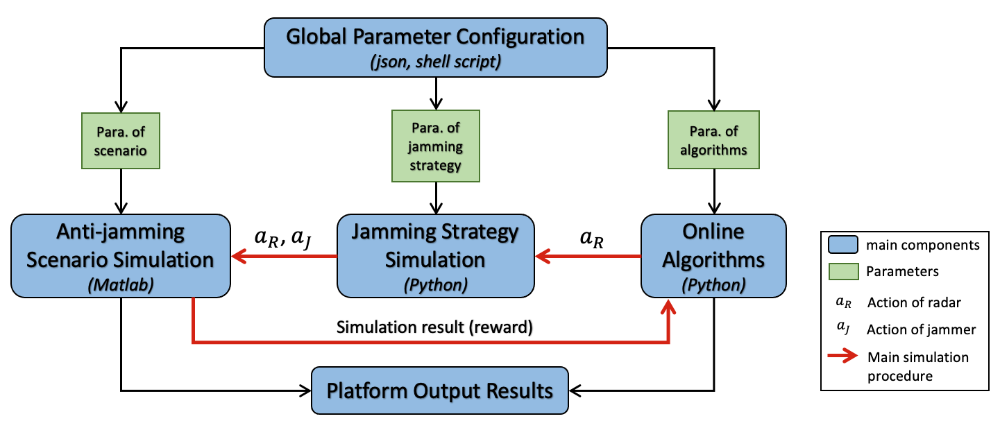

# Radar Platform
## Basic Structure


The detailed flowchat for the anti-jamming platform


### General Parameter Setting
All the parameters utilzied in both Signal Simulation and Algorithm Simulation are stored in `setting.json`.
### Signal Simulation Part
The signal simulation results are generated in Matlab and connected with different algorithms in Python by different function packages.

* `overall_func`: Directly generate the final reward for `step` function in python environemnts. 
* `sig_gene`: Generating for radar and jammer transmitting signal
* `collector_gene`: Collect received signals combined with target signal, jamming signal and noise.
* `reward_gene`: Matched filtering processing and reward calculation as the output of the environment.

### Algorithm Simulation Part
1. Bandit algorithms simulation

* ALgorithms included: Hedge, RM, Exp3, UCB, TS, OTS.
* All the bandit algorithms are stored in `algorithm.To_Bandit.algorithms`.
* Environment generated from signal simulation is stored in `jammer_environment.radar_singlejam` and `jammer_environment.reward_radar_algo_final`.

2. Model-free reinforcement learning simulation 
* Algorithms included: DQN, PPO, TRPO
* The algorithms are basically built on the `tianshou` framework and stored in `algorithm.To_Model_Free_RL`.
* Environment generated from signal simulation is stored in `jammer_environment.radarenv` and `jammer_environment.reward_radar_algo_final`.

## Installation
1. `Torch`, `Numpy`, `Matlab`, `Tianshou`, `gymnasium` and `scipy` are required for reinforcement learning simulation
2. `collections`, `pickle`, `datetime` and `argparse` are additionally added to run bandit algorithms.
3. One can simply run the following command to install all the environment.
```python
pip install -r requirements.txt
pip install torch==1.12.1+cu113 torchvision==0.13.1+cu113 torchaudio==0.12.1 --extra-index-url https://download.pytorch.org/whl/cu113
```
4. The radargame environemnts are stored in `signal_simulate.overall_func`, `signal_simulate.sig_gene`, `signal_simulate.collector_gene` and `signal_simulate.reward_gene`.
   To install any of these environments, one can go into the subfolder `for_testing` then run 
```python
python setup.py install
```
   Before that, one should ensure that the `matlab_runtime` package is contained in the system. 
   * The provided python package are compiled using `matlab_runtime==9.12`
   * For windows, we provide executable program for online download in `signal_simulate.*.for_redistribution.MyAppInstaller_web.exe`.
     For linux, one can download the program from `https://ww2.mathworks.cn/products/compiler/matlab-runtime.html`.
   * Set the environment path of `matlab_runtime`.
## Usage
* Reward_Matrix mode (numsp=numsf=3]):
One should ensure the corresponding `.mat` file is included in `jammer_environment`. To generate `.mat` file, one can run:
```python
### This is the matlab_engine version
cd ./signal_simulate/matlab/
python ./gene_mat.py --numsp 3 --numsf 3
```
or
```python
### This is the python package version. Before that, one should ensure that `gene_single_mat_val` package is installed properly. Specifically, refer to `Installation 4` section.
cd ./signal_simulate/matlab/
python ./gene_mat_pip_version.py --numsp 3 --numsf 3
```
* real-time interactive mode
`To_Model_Free_RL`: In order to switch to this mode, one need to set `select_version=0` while in initialization of `RadarGameEnv`.
 `To_Bandit`: During the `step` function, one can switch `interact_version` to `1` for this mode.
